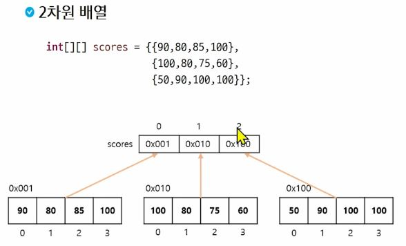

# 2차원 배열
## 다차원 배열
- 배열 요소로 또 다른 배열(참조값)을 가지는 배열
- 2차원 배열은 배열 요소로 1차원 배열의 참조를 가지는 배열
- 3차원 배열은 배열 요소로 2차원 배열의 참조를 가지는 배열
- 1차원 배열은 객체로 취급함(참조형 변수)

## 2차원 배열 선언
- `**int[][] arr1**` <- 이녀석 선호
- `int arr2[][]`
- `int[] arr3[]`

## 2차원 배열 생성
- `배열의 이름 = new 배열유형[1차원 배열개수][1차원 배열의 크기];`
- `배열의 이름 = new 배열유형 [1차원 배열개수][];`

    아래 녀석 선호 - 1차원 배열의 크기가 달라질 수 있으니 굳이 열 값 만들어 둘 필요 없긴함

배열 생성 가능
```java
int[][] arr2 = new int[][]{
    {1,2,3,4},
    {5,6,7,8},
    {9,10,11,12}
};

int[][] arr3 ={
    {1,2,3,4},
    {5,6,7},
    {8}
};
```

행 길이 지정
```java
int[][] arr1 = new int[3][4]; //
int[][] arr2 = new int[3][]; //1차원 배열의 갯수만 지정(행의 크기만 지정)
//1차원 배열은 아직 생성되지 않았고, 연결되지 않음

System.out.println(arr1[1][1]); // 0
System.out.println(arr2[0]); // null(1차원배열은 참조형 변수로 null로 초기화되므로)

arr2[0] = new int[] {1, 2, 3};
arr2[1] = new int[] {4, 5, 6, 7, 8};
arr2[3] = new int[] {9, 10};

//2차원 배열의 원소에 접근
//행의 번호를 지정 => 실제 1차원 배열안에서 각원소의 index 지정(열)
arr2[1][4]
```



그냥 행열로 생각해도 괜찮음

## 2차원 배열의 순회

1. 행 우선 순회
2. 열 우선 순회
3. 지그재그 순회

```java
int[][] arr = {
    {1,2,3,4},
    {5,6,7,8},
    {9,10,11,12}
};

//바깥쪽 for문 : 행, 안쪽for문 : 열
for(int r=0; r < arr.length; r++) {
    for(int c=0; c<arr[r].length; c++) {
        System.out.print(arr[r][c]+" ");
    }
    System.out.println();
}
System.out.println("---");
//열우선 순회
for(int c = 0; c<4; c++) {
    for(int r= 0; r<3; r++) {
        System.out.print(arr[r][c]+" ");
    }
    System.out.println();
}

System.out.println("---");
//지그재그 순회
//행우선 순회
// 0,2,4 ... 행 -> 정방향 -> index기준 짝수일 경우
// 1,3,5 ... 행 -> 거꾸로 -> index 홀수
for(int r=0; r<3; r++) {
    if(r%2 == 0) {
        for(int c=0; c<4; c++) {
            System.out.print(arr[r][c]+" ");
        }
    }else {
        for(int c =3; c>=0; c--) {
            System.out.print(arr[r][c]+" ");
        }
    }
    System.out.println();
}
```

## 2차원 배열 순회 응용
### 삼각형 만들기
#### 모양 1
1 2 3 4<br>
  5 6 7<br>
    8 9<br>
      100

```java
int cnt = 0;

```