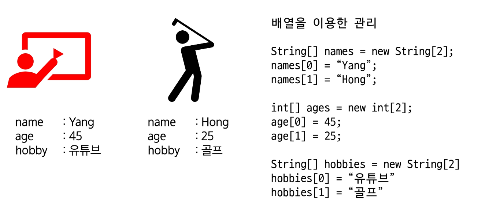

# 객체지향 프로그래밍
## 객체지향 프로그래밍(OOP, Object Oriendted Programming)
- 객체: 사물과 같이 유형적인 것과 개념이나 논리와 같은 무형적인 것들
1. 객체 단위로 나누어서(조직화)
2. 객체 간의 상호작용으로 sw를 설계.구현

### 클래스(class)
- 객체를 만드는 설계도
- 붕어빵 틀이라 생각해
### 인스턴스(Instance)
> 클래슬르 통해 생성된 객체

일일이 원하는 것을 그때 그때 만들지 말고, 클래스라는 틀을 만들고 만들게 될때 그때그때 찍어내라

### 객체지향 프로그래밍 특징(A PIE)
#### Abstraction(추상화)
- 현실 객체 => SW객체
#### Polymorphism(다형성)
- 하나의 객체를 다양한 형으로 참조(관점)
- 사람을 학생, 환자, 고객 등으로 관점에 따라서 다르게 볼 수도 있지
#### Inheritance(상속)
- 기존 클래스 재활용 -> 새로운 클래슬를 만들어 낸다.
#### Encapsulation(캡슐화)
1. 데이터와 로직이 한 단위로 묶여 있는 것

2. 객체의 속성과 행위는 두가지로 나뉨
    - 공개하는 것
    - 공개하지 않는 것
    - 마치 캡슐의 투명한 부분과 불투명한 부분이 있는 느낌

### 객체지향 프로그래밍 장점
1. 모듈화된 프로그래밍
2. 재사용성이 높다.
3. 디버깅이 용이
4. 정보 보호
5. 협업

## 클래스
#### 사람의 정보를 관리하자.
배열을 이용한 관리

인덱스와 해당데이터를 연겨하는데 실수할 수도 있음

**이러니 클래스 사용**

#### 간단 사용 예
```java
public class Person {
	// 멤버 변수(필드) : 그 객체가 가지고 있는 data, 속성.
	String name;
	int age;
	String hobby;
}
```

```java
public class PersonTest {
	public static void main(String[] args) {
		Person yang = new Person();
		// yang : instance
		yang.name = "Yang";
		yang.age = 28;
		yang.hobby = "Youtube";
		System.out.println(yang.hobby);//Youtube
	}
}
```

### 함수
#### 함수란?
- 특정한 작업(기능)을 수행하는 문장들을 한 단위로 묶은 것.
- 자바에서는 메서드라는 용어를 사용(클래스 안에 정의된 함수)

#### public
다른 클래스에서 접근가능하다.
#### static
객체 생성 없이 사용 가능하다.
#### void
반환을 none으로 한다.

사용예1
```java
public class FunctionTest1 {
	public static void main(String[] args) {
		교육();
        이동("교육장","대중교통");
		이동("집","자동차");
	}
	// static 메서드는 static메서드만 호출 가능.
	static void 교육() {
		System.out.println("오전 수업을 듣는다.");
		System.out.println("점심을 먹는다.");
		System.out.println("오후 수업을 듣는다.");
	}
    static void 이동(String 장소, String 탈것) {
		System.out.println(장소+"(으)로"+탈것+"(을)를 이용하여 이동한다.");		
	}
}
```
- 함수의 호출은 `함수명(매개변수,...);`


