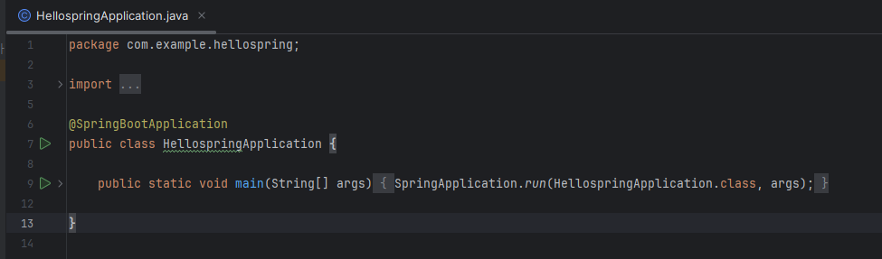
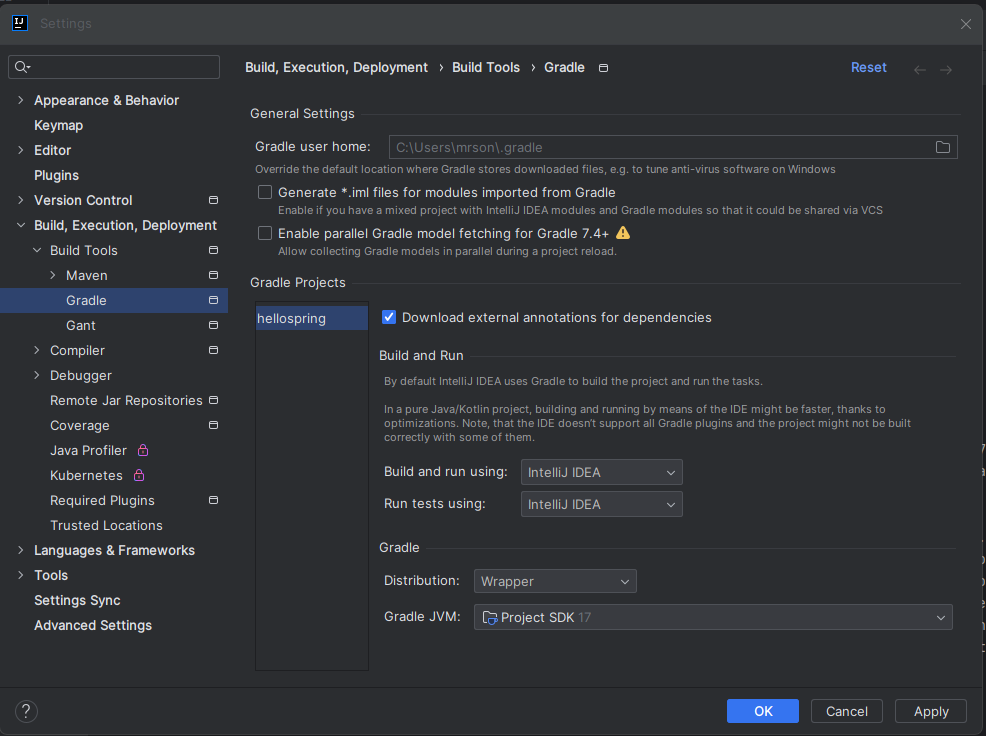
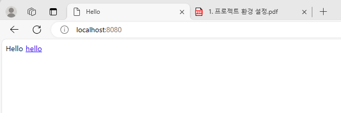
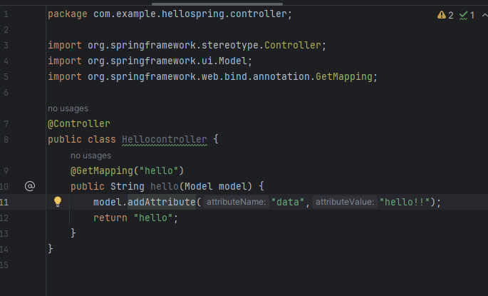
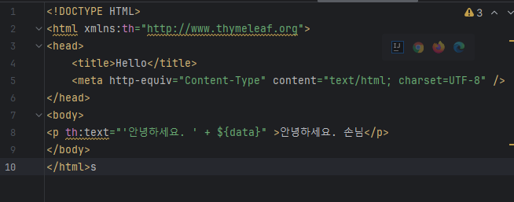
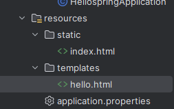
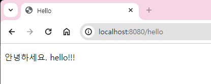

## 프로젝트 생성

### 스프링 부트에서 스프링 프로젝트 생성

https://start.spring.io/

- 프로젝트 선택 : Gradle-Groogy
- Packaging : Gar
- Java - 17
- Group에는 보통 그룹명 적음
- **Dependencies - spring web, thymeleaf**
#### 이후 Generate 해줘

압축 풀고<br>
인텔리제이 키고 open<br>
 hello-spring 폴더 안에 `build.gradle`을 선택 후 open - open as project 선택


- resources - 자바 파일을 제외한 파일들 들어감

- build.gradle - dependencies 적혀있음. 

mavenCentral()에서 dependencies 다운로드 받음

## 일단 시작

HellospringApplication.java 파일 열고 시작 버튼 눌러!

그 후 웹 브라우저 켜서 `localhost:8080` 입력

웹브라우저에 에러 표시 뜨면 성공


### 참고
인텔리제이를 사용하면 자바를 직접 실행하는게 아니라 Gradle을 통해 실행되는 경우가 있음<br>
설정에서 gradle 검색



## 라이브러리 살펴보기
build.gradle에 보면
- thymeleaf - html만들어주는 라이브러리
- web
- test
정도 있음 

근데 보면 많은 라이브러리들이 있음


열어서 Dependcies에서 라이브러리들을 볼 수 있음

스피링 부트

### log 
서버 개발자들은 sysout 말고 log 사용<br>
spring boot starter logging 자동으로 dependencies에 추가됨
- 요즘은 logback과 slff4 조합으로 많이 사용함

junit : 테스트 프레임워크

## View 환경설정
### Welcompage 만들기

`resources/static/index.html` 파일에 아래 내용 넣으면 welcompage를 만들어줌
```html
<!DOCTYPE HTML>
<html>
<head>
 <title>Hello</title>
 <meta http-equiv="Content-Type" content="text/html; charset=UTF-8" />
</head>
<body>
Hello
<a href="/hello">hello</a>
</body>
</html>
```
`src/main/resources/static`폴더에 `index.html` 만들어주면 그게 웰컴페이지가 된다.



- 스프링 부트가 제공하는 welcome page 기능

-spring.io > springboot > learn > current Reference Document <br>
에서 확인 쫙~ 가능
- index.html 검색해서 확인 가능

그냥 정적페이지긴 함.

## thymleaf 템플릿 엔진
템플릿 엔진을 쓰면 원하는 대로 모양을 바꿀 수 있음

### controler 생성
controller 웹 어플리케이션에서 첫 진입점

hello.hellospring 밑에 controller라는 패키지 생성

그 밑에 HelloController 만들어주라

우선 @하고 Controller하고 적어줘야 한다


위와 같이 따라하면 된다.

그리고 templates 아래에 `hello.html` 생성하자

`return "hello";` : temlplates에 있는  hello.html로 가라~

`@GetMapping("hello")`




시키는 대로 하고 `localhost:8080/hello` 들어갔었는데 Whitelabel error 떴었음...

대체 왜그런가 하나하나 보니 내가 hello.html을 만든다는 것을 hellio.html이라 만들어 버림... 바보



- 정상적으로 된다면 다음과 같이 나타난다.


-  컨트롤러에서 리턴 값으로 문자를 반환하면 뷰 리졸버(`viewResolver`)가 화면을 찾아서 처리한다.
    - 스피링 부트 템플릿엔진 기본 viewName 매핑
    - `resource:templates/` +{viewName}+`.html`

### 참고
`spring-boot-devtools`라이브러리를 추가하면, `html` 파일을 컴파일만 해주면 서버 재시작 없이 View파일 변경이 가능하다.

인텔리J 컴파일 방법: 메뉴 build-> Recompile

## 빌드하고 실행하기
콘솔로 이동(일단 서버 꺼라)

1. `./gradlew build`
2. `cd build/libs` : 빌드한 폴더로 이동
3. `java -jar hello-spring-0.0.1-SNAPSHOT.jar` : 자바파일 실행

그니까 서버 배포할때는 `hello-spring-0.0.1-SNAPSHOT.jar` 이 파일만 복사해서 서버에 넣고 `java -jar hello-spring-0.0.1-SNAPSHOT.jar` 이렇게 실행시켜주면 된다고 함. 그러면 서버에서도 스프링이 동작하게 된다.

빌드하고 서버 켰을 때 다시 끄려면 `cntrl + c` 

### 참고
혹시나 잘 안되는 사람들을 위해 알려주심 <br>
일단 상위 폴더로 올라가서 `/gradlew clean build` 하면 완전히 지우고 다실 빌드한다고 함<br>
그 이후로 하면 됨