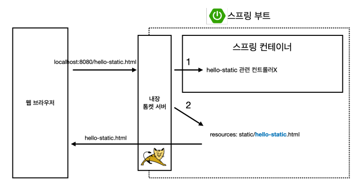
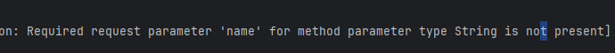
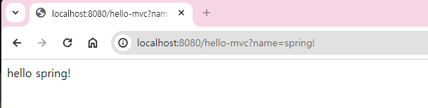
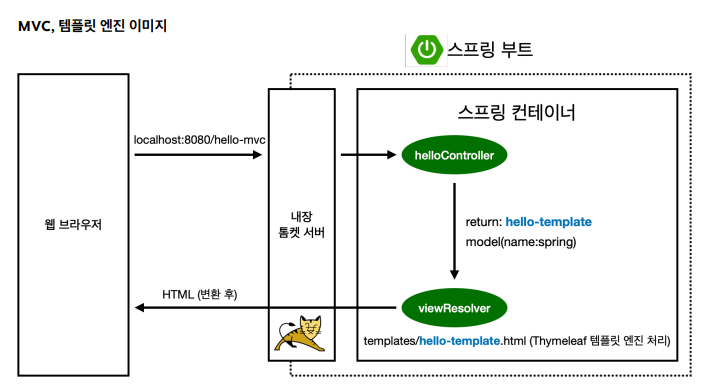
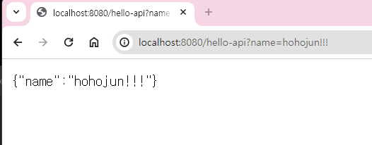
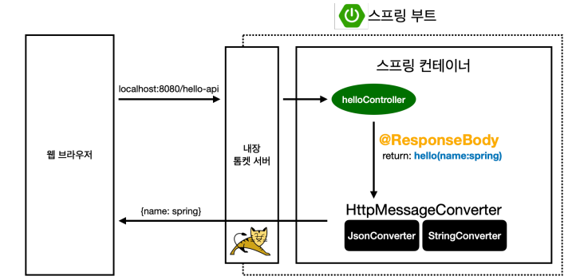

# 스프링 웹 개발 기초

## 정적 컨텐츠

- static폴더에 아무 html파일 만들어줄거임<br>
`resources/static/hello-static.html`
- 그리고 서버 켜주고
- url은 hell0-static.html 그대로 들어와줘


정적 컨텐츠를 열어주게 되는 순서


## MVC와 템플릿 엔진
MVC - Model, View, Controller

Controller - 내부적인 걸 처리
```java
@Controller
public class HelloController {
 @GetMapping("hello-mvc")
 public String helloMvc(@RequestParam("name") String name, Model model) {
 model.addAttribute("name", name);
 return "hello-template";
 }
}
```

`resources/templates/hello-template.html`만들고
View - 화면 그리는데 모든 역량을 집중
```html
<html xmlns:th="http://www.thymeleaf.org">
<body>
<p th:text="'hello ' + ${name}">hello! empty</p>
</body>
</html>
```
- 절대 경로 복사해서 웹페이지에 붙이면 열림
- 서버 없이 출력할때는 "hello! empty"가 출력됨
- 실제 서버에서 돌면 앞에 있는 "'hello ' + ${name}"이 출력될거임


해결방법
- 아오 바본가 "@" 빼먹음
- 아오 근데 왜 또 안돼..
- 다시 처음부터 하니까 되네..

### `http://localhost:8080/hello-mvc`와 같이 쳤을 때
또 에러 뜸

name의 값을 안줘서 그래

#### 그래서 `http://localhost:8080/hello-mvc?name=spring!` 처럼 뒤에 name 값 넣어주면


정상작동 한다.ㅠㅠ




## API
JSON이라는 데이터 구조 포맷으로 클라이언트에게 전달해주는 방식


HelloController에서
```java
@GetMapping("hello-string")
@ResponseBody
public String helloString(@RequestParam("name") String name){
    return "hello" + name; // "hello spring"이런식으로
}
```

### `@ResponseBody` 의미
HTTP에서 header부와 body부가 있음<br>
body부에 return값(즉, `"hello" + name`)을 내가 직접 넣어주겠다 라는 의미


위 페이지를 "페이지 소스 보기"로 열어도 HTML 파일이 아닌 무식하게 그냥 데이터만 있는 걸 알 수 있음


### 

#### Getter 와 Setter 가져오기
단축키는 **`alt + insert`** 로 Generate 창을 키고 `Getter and Setter` 클릭해서 가져오자

controller 내용 작성
```java
@GetMapping("hello-api")
@ResponseBody
public Hello helloApi(@RequestParam("name") String name){
    Hello hello = new Hello(); //객체 만들기
    hello.setName(name);
    return hello;
}

static class Hello{
    private String name;

    public String getName() {
        return name;
    }

    public void setName(String name) {
        this.name = name;
    }
}
```

실행 결과를 보면

Json 구조로 나옴

#### ResponseBody 사용 원리


`@ResponseBody`를 사용
- HTTP의 BODY에 문자 내용을 직접 반환
- `viewResolver`대신에 `HttpMessageConverter`가 동작
- 기본 문자처리 : `StringHttpMessageConverter`
- 기본 객체처리 : `MappingJackson2HttpMessageConverter`
    - 객체를 Json으로 바꿔주는 유명한 라이브러리(Jackson)
- byte 처리 등등 기타 여러 HttpMessageConverter가 기본으로 등록되어 있음