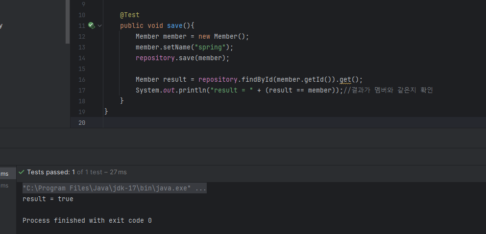

# 백엔드 개발
## 비즈니스 요구사항 정리
- 데이터 : 회원ID, 이름
- 기능 : 회원 등록, 조회
- 아직 데이터 저장소가 선정되지 않음(가상의 시나리오)


- 아직 데이터 저장소가 선정되지 않아서 우선 인터페이스로 구현 클래스를 변경할 수 있도록 설계
- 데이터 저장소는 RDB, NoSQL 등등 다양한 저장소를 고민중인 상황으로 가정
- 개발을 진행하기 위해서 초기 개발 단계에서는 구현체로 가벼운 메모리 기반의 데이터 저장소 사용

## 회원 도메인과 리포지토리 만들기
### controller와 형제 위치에 도메인 package 생성
- 내부에 member라는 클래스 만들자
- Getter와 Setter도 만들자
기본틀
```java
public class Member {
    private Long id; //임의의 값. 고객이 정하는 id말고 시스템이 정하는 아이디
    private String name;

    public Long getId() {
        return id;
    }
    public void setId(Long id) {
        this.id = id;
    }
    public String getName() {
        return name;
    }
    public void setName(String name) {
        this.name = name;
    }
}

```
### controller와 형제 위치에 repository 페키지 생성
#### 그 내부에 MemberRepository라는 인터페이스 생성


```java
public interface MemberRepository {
    Member save(Member member);//회원 저장소 저장
    Optional<Member> findById(Long id);//저장소에서 id로 회원찾기
    Optional<Member> findByName(String name);//저장소에서 회원 이름 찾기
    List<Member> findAll();//저장된 모든 회원리스트 반환
}
```
findById나 findByName에서 가져오는게 null일 수도 있음. null을 그대로 반환할 수도 있는데 요즘은 null을 그냥 반환하는 것보다 optional을 감싸서 반환하는게 선호된다고 함.. 사실 잘 모르겠음

### repository아래에 MemoryMemberRepository라는 클래스 생성(회원 리포지토리 메모리 구현체)


내용을 위처럼 작성하고 빨간색이 뜨는데

`alt + Enter`클릭 후 `Implement Methods`클릭

모두 선택 후 ok 

실무에서는 동시성 문제가 있을 수 있어서 공유되는 변수일 경우 (컨크루트 해쉬맵? 써야한다고 한 거 같은데 발음 확실히 모르겠음) 


```java
public class MemoryMemberRepository implements MemberRepository{
    private static Map<Long, Member> store = new HashMap<>();
    private static long sequence = 0L;

    @Override
    public Member save(Member member) {
        member.setId(++sequence);//
        store.put(member.getId(), member);
        return member;
    }

    @Override
    public Optional<Member> findById(Long id) {
        return Optional.ofNullable(store.get(id)); //스토어에서 꺼내면 되! 라고 말씀하심..
        // 근데 그 결과가 없으면 Null일텐데 Optional.ofNullable 요걸로 감싸주면 클라이언트에서 뭘 할 수 있다함
    }

    @Override
    public Optional<Member> findByName(String name) {
        return store.values().stream()
                .filter(member -> member.getName().equals(name))
                .findAny();
    }

    @Override
    public List<Member> findAll() {
        return new ArrayList<>(store.values());
    }
}
```

## 회원 리포지토리 테스트 케이스 작성
개발한 기능을 실행해서 테스트 할 때 자바의 <u>main메서드</u>를 통해서 실행하거나, 웹 어플리케이션의 컨트롤러를 통해서 해당 기능을 실행한다. 이러한 방법은 준비하고 실행하는데 오래 걸리고, 반복 실행하기 어렵고 여러 테스트를 한번에 실행하기 어렵다는 단점이 있다. 자바는 <u>JUnit이라는 프레임워크로</u> 테스트를 실행해서 이러한 문제를 해결한다.

### 회원 리포지토리 메모리 구현체 테스트

`src/test/java/hello.hellospring`에 `repository`라는 package 생성<br>
또 그 밑에 `MemoryMemberRepositoryTest` class 만들어


@Test 치고 import해


그리고 그냥 스타트버튼 눌러서 실행해


그럼 그냥 그 메서드가 실행이 됨

**테스트 코드 작성**
```java
@Test
public void save(){
    Member member = new Member();
    member.setName("spring");
    repository.save(member);

    Member result = repository.findById(member.getId()).get();
    System.out.println("result = " + (result == member));//결과가 멤버와 같은지 확인
}
```


맨 마지막 줄 결과나오는 부분을 바꿔서<br>
`Assertions.assertEquals(member, result);` 이렇게 쓸 수 있음


```java
@Test
public void findByName(){
    Member member1 = new Member();
    member1.setName("spring1");
    repository.save(member1);

    Member member2 = new Member();
    member2.setName("spring2");
    repository.save(member2);

    Member result = repository.findByName("spring1").get(); //get으로 꺼내면 optional한번 깔 수 있음
    Assertions.assertEquals(member1, result);
}
```
마찬가지로 이녀석을 실행하면 초록불이 뜨고 별일 없음. 잘 됬다는 거긴하지
만약 `Member result = repository.findByName("spring2").get();` 로 바꾸면 result는 member2가 되겠지. 그래서 돌리면 빨갛불 떠


#### 테스트가 좋은점
클래스 레벨에서 같이 돌릴 수 있음

#### 테스트가 끝나고 나면 데이터를 clear 해줘야함. 왜냐하면 테스트들끼리 간섭있을 수도 있으니...

`MemoryMemberRepository` 에 테스트 끝날때마다 repository를 깔끔하게 지워주는 코드 넣어야해

테스트는 순서와 상관없이 서로간의 의존관계 없이 끝나야 해. 그러기 위해선 하나의 테스트가 끝날때마다 저장소나 공용 데이터들을 깔끔하게 지워줘야 함. 그래야 문제 없음

```java
@AfterEach
public void afterEach(){
    ...
}
```
강사님이 AfterEach라는 태그 붙여야한다고 하셨는데 ... 안떠.... 허허